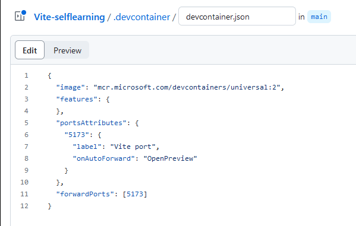

# This is Jiajia's course note:

This is a self-learned project as an assignment of PD4 course of RRC.

## 1. Building a Weather App with AI Power

Beyond ChatGPT : what AI can do for you:
   
What is AI ? 
It is not chatbot, it is a middle transformer to transform information between users and system. It will transform information as users' prefer format.
   
Developer could use this capacity to transform human language into structured data software it can work with.

## 2. A more useful weather app
use ai to meet two functionalities:
1. get user's weather command,then figure out the location.
2. parse the weather data using other API to get the weather data.

## 3. Ideating with ChatGPT as a base
API: 
for location:
https://openweathermap.org/api/geocoding-api
for weather data:
https://openweathermap.org/current

`test the ai:`
> ChatGPT chat command: 
> 
> 1. First command: 
> 
> Act like a location string generator. Based on my prompt, create a location string following this specific format:
[city],[two-letter state code],[two-letter country code]
>
>Example:
  Me: "What's the weather like in London, Ontario?"
  You: "London, ON,CA"
>
> 2. Second command: 
> 
> What's the weather like in Winnipeg?
>
> 3. Third command: 
> 
> Do I need to wear sunscreen in Oslo?
> **the answer is wrong.
>
>  4. Fourth command: 
> 
> Based on the JSON below, describe the current weather in this location?

## 4. Sidebar: Build a React app using Vite and Github Codespaces
> Vitejs : https://vitejs.dev/guide/

4.1 create a repository in github
  then open codespaces to config a dev,enter the following,then commit the changes:
  ```
  {
  "image": "mcr.microsoft.com/devcontainers/universal:2",
  "features": {
  },
  "portsAttributes": {
    "5173": {
      "label": "Vite port",
      "onAutoForward": "OpenPreview"
    }
  },
  "forwardPorts": [5173]
}
  ```
  **OpenPreview means that it will open a preview inside VS code itself in the browser.

  
  >these configuration of vite port is to work for the browser preview which the browser will connect to the port.

4.2 create a codespace on main
> This codespace is a virtual machine that runs my project inside Visual Studio Code in my browser.

Steps:
```
a. terminal run: npm create vite@latest
b. Choose React--javascript+ svm--create the folder and cd it.
c. Run: npm install
d. Run: npm run dev
```


## 5. Boot up the app in GitHub Codespaces
use online codespace or use the real local environment.

## 6.Work with the OpenWeatherMap API
1) Modify the API in `.env.local.template` file to connect the weathermap API.
    ```
    VITE_OPENAI=[Your OpenAI API Key]
    VITE_OWM=[Your Open Weather Map API Key]
    ```
    **Delete the first line, change you API key into the second line.

2) Rename the file `.env.local`.
3) Create an API key.
   ```
   go to weather map website,create an account and then apply for a API key.

   https://home.openweathermap.org/
   ```

## 7. APP work-through
Introduce the app.jsx in the react.

## 8. What is the OpenAI API, and how does it relate to ChatGPT?
1) ChatGPT is based on OpenAI API. So we can use OpenAI API to create our own code. OpenAI API provides much deeper code access than ChatGPT. As a developer has a more control of the AI without the user filters ChatGPT.
2) When use OpenAI API , pay for the token use. So the bigger prompts you use or more prompt you send, the more money you spend.
3) Most of the OpenAI API is just like the other APIs, except that the current AI API is non-deterministic. That means we will not know what the response is , no matter how much you try to control it.

## 9. Test the API in the OpenAI playground
1) put the rules in system chat box
2) then give the user input question
3) submit , get the answer with chatgpt 3.5 turbo or other version. Which we can choose.

## 10. Generate secret keys
1) API key generate. When a new API created, copy it immediately.
2) Paste the API key into `env.local`:
   ```
   VITE_OPENAI= 'paste the API key here'
   ```
  
## 11. Test the API with client
The REST client we chosen is Postman.
> REST client : the term "REST client" refers to the software or tools that consume or use REST APIs, not the organizations or services that provide them. These clients make requests to and handle responses from RESTful services to access or manipulate resources.


  


